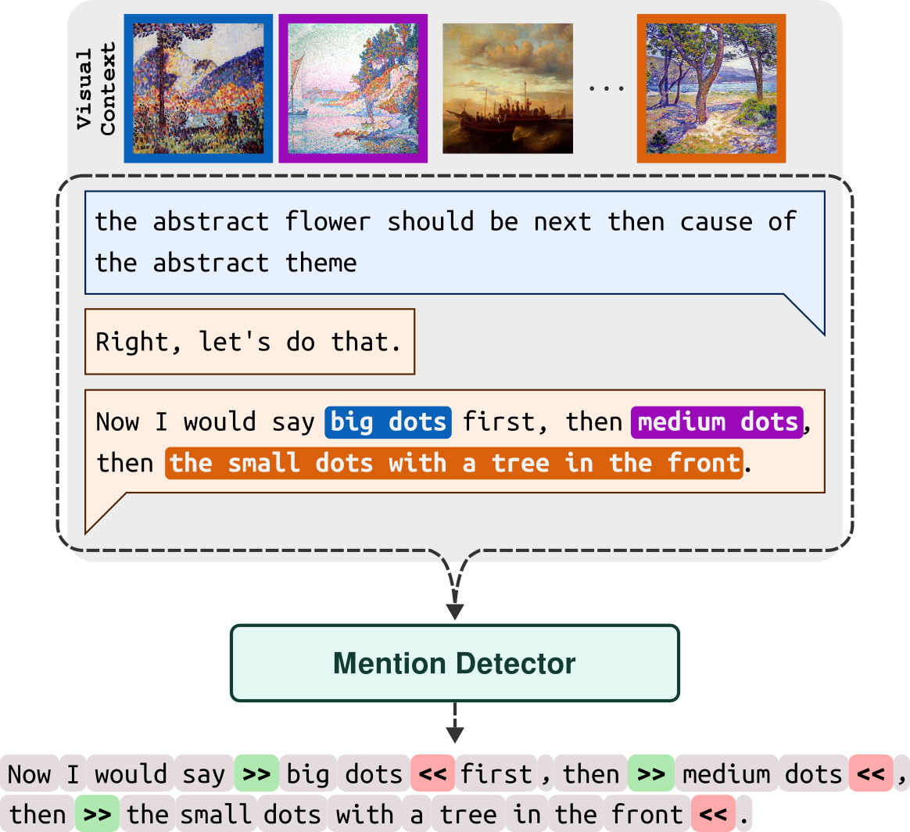

# Detecting Referring Expressions in Visually Grounded Dialogue with Autoregressive Language Models

> [!NOTE]  
> We are in the process of adding the material described in our paper to this repo.

Repository for the paper "[Detecting Referring Expressions in Visually Grounded Dialogue with Autoregressive Language Models](https://arxiv.org/abs/2506.21294)" to be presented at [XLLM @ ACL 2025](https://xllms.github.io/), the 1st Joint Workshop on Large Language Models and Structure Modeling. 
Please cite the following work if you use anything from this repository or from our paper:

```bibtex
@misc{willemsen2025detectingreferringexpressionsvisually,
      title={Detecting Referring Expressions in Visually Grounded Dialogue with Autoregressive Language Models}, 
      author={Bram Willemsen and Gabriel Skantze},
      year={2025},
      eprint={2506.21294},
      archivePrefix={arXiv},
      primaryClass={cs.CL},
      url={https://arxiv.org/abs/2506.21294}, 
}
```

***

## :scroll: Overview

- [:telescope: The Task](#the-task)
- [:page_facing_up: The Data](#the-data)
- [:spaghetti: The Code](#the-code)
- [:floppy_disk: The LoRA Weights](#the-lora-weights)
- [:printer: The Output](#the-output)

***

## <a name="the-task"></a> :telescope: The Task

In this paper, we ...
> ... we explore the use of a text-only, autoregressive language modeling approach for the extraction of referring expressions from visually grounded dialogue. More specifically, the aim is to investigate the extent to which the linguistic context alone can inform the detection of mentions that have a (visually perceivable) referent in the visual context of the conversation. To this end, we adapt a pretrained large language model (LLM) to perform a relatively course-grained annotation of mention spans in unfolding conversations by demarcating mention span boundaries in text via next-token prediction.

We fine-tune an autoregressive LLM, [Llama 3.1](https://arxiv.org/abs/2407.21783)-8B, to perform mention detection as proposed and contrast performance of the generative method with both a sequence labeling approach that uses a fine-tuned [ModernBERT](https://arxiv.org/abs/2412.13663)-large and a simple noun phrase extraction baseline based on constituency parsing using the [Stanza](https://aclanthology.org/2020.acl-demos.14/) toolkit.
Figure 1 provides a visualization of the proposed generative approach.

<div align="center"> <p>Figure 1: Visualization of the proposed mention detection method. The <b>Mention Detector</b> takes as input the most recent dialogue message, preceded by the available dialogue history, and autoregressively outputs an annotated reproduction of the last message while inserting mention span boundary tokens.</p></div>

For more details, we refer the reader to our [paper](https://arxiv.org/abs/2506.21294).

***

## <a name="the-data"></a> :page_facing_up: The Data

We use data from the visually grounded dialogue tasks "[A Game Of Sorts](https://github.com/willemsenbram/a-game-of-sorts)" and "[PhotoBook](https://github.com/dmg-photobook/photobook_dataset)" for the fine-tuning and evaluation of our proposed method.

In order to reproduce our work you will need the "[A Game Of Sorts](https://github.com/willemsenbram/a-game-of-sorts)" and "[PhotoBook](https://github.com/dmg-photobook/photobook_dataset)" data, as well as the mention annotations. 

For **A Game Of Sorts**, we use the mentions annotations from "[Resolving References in Visually-Grounded Dialogue via Text Generation](https://aclanthology.org/2023.sigdial-1.43/)".

For **PhotoBook**, we provide mention annotations for the so-called PB-GOLD subset as part of this work; :warning: `AVAILABLE SOON` :warning: 


```
git clone https://github.com/willemsenbram/a-game-of-sorts.git
git clone https://github.com/willemsenbram/reference-resolution-via-text-generation.git
git clone https://github.com/dmg-photobook/photobook_dataset.git
git clone https://github.com/ecekt/clip-desc-disc.git
```

For more information about the **A Game Of Sorts** dataset, we refer the reader to the "[Collecting Visually-Grounded Dialogue with A Game Of Sorts](https://aclanthology.org/2022.lrec-1.242/)" paper.

For more information about the **A Game Of Sorts** mention annotations, we refer the reader to the "[Resolving References in Visually-Grounded Dialogue via Text Generation](https://aclanthology.org/2023.sigdial-1.43/)" paper. 

For more information about the **PhotoBook** dataset, we refer the reader to the "[The PhotoBook Dataset: Building Common Ground through Visually-Grounded Dialogue](https://aclanthology.org/P19-1184/)" paper.

For more information about the **PB-GOLD** subset, we refer the reader to the "[Less Descriptive yet Discriminative: Quantifying the Properties of Multimodal Referring Utterances via CLIP](https://aclanthology.org/2022.cmcl-1.4/)" paper.

***

## <a name="the-code"></a> :spaghetti: The Code

***

## <a name="the-lora-weights"></a> :floppy_disk: The LoRA Weights

***

## <a name="the-output"></a> :printer: The Output

The output of the models on which the results of the experiments reported in the paper are based can be found in :warning: `AVAILABLE SOON` :warning:.

***
